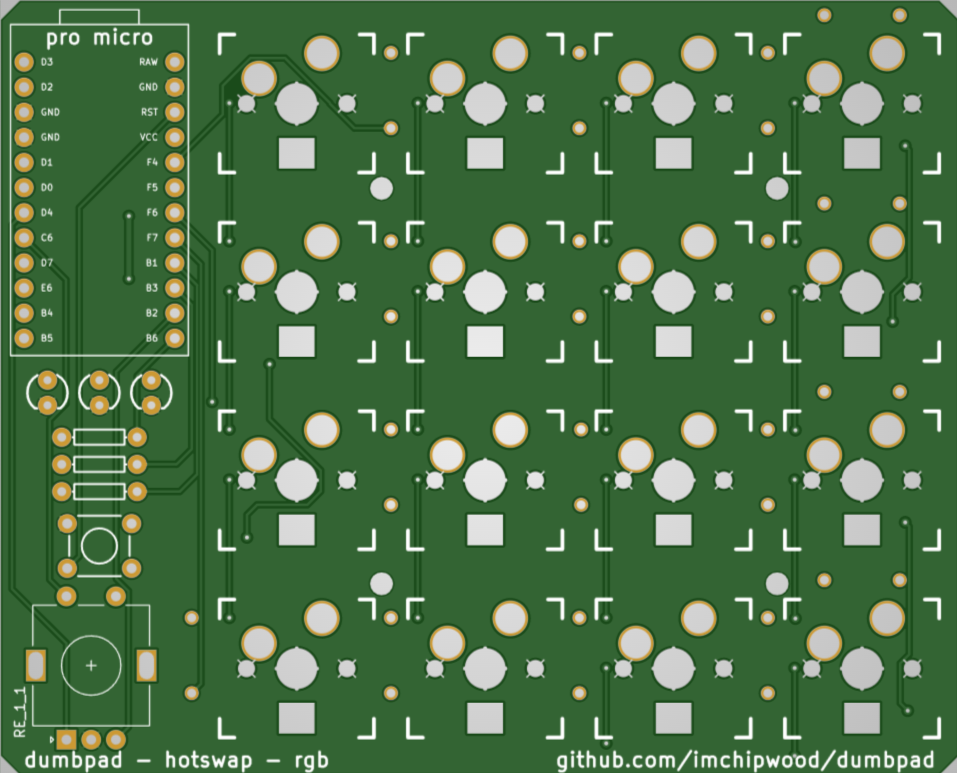
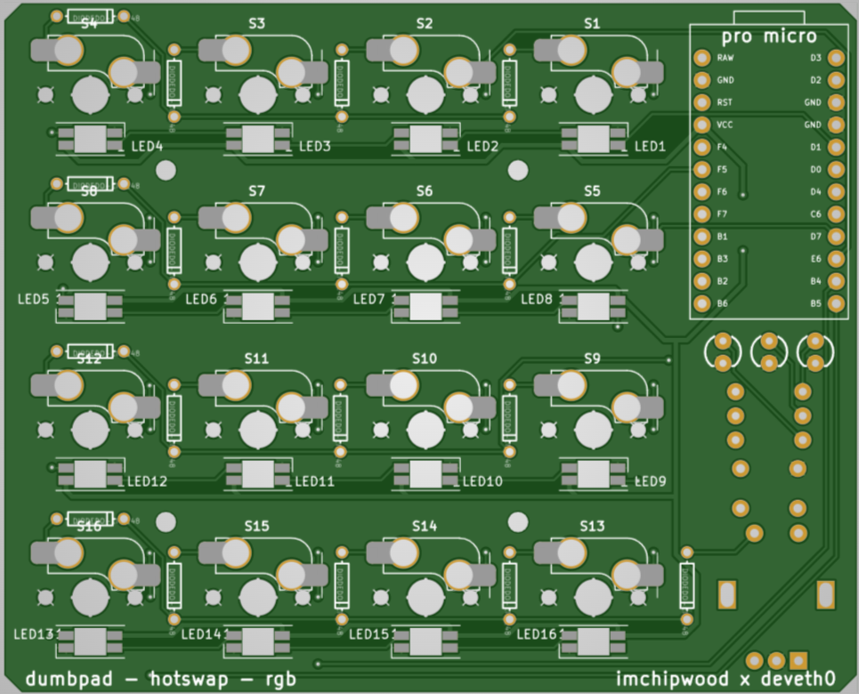

# dumbpad - Hotswap - RGB - OLED

Designed by [n1ghtBl00d](https://www.github.com/n1ghtBl00d).

## Description

Combination of the Hotswap and OLED variants

### Revisions

- 3.1 Initial published PCB
- 3.2 Replaced Indicator LEDs with OLED Screen socket

#### dumbpad v3.1

#### Renders

### Bill of materials

* 16x Kailh Hotswap Sockets (rev 2)
* 16x Cherry-style mechanical switches
* 17x 1n4148 diodes (thru hole)
* 1x Arduino Pro Micro or pin-compatible ATmega32u4-based MCU
* 1x EC11 rotary encoder with pushbutton (7-pin)
* (optional) 16x SK6812 mini e LEDs
* (optional) 1x 6mm tactile switch (to reset MCU)
* (optional) 3x 3mm LEDs (whatever color)
* (optional) 3x 330ohm or similar resistors for the LEDS (not needed if not adding LEDs)

## Making the PCB

Submit either the KiCad `.kicad_pcb` or the gerber files to your prefered PCB manufacturer.

### Notes on soldering

It's recommended to start with the Sockets and then add the remaining parts.

Solder the SK6812 LEDs with the missing corners aligned with the corners printed on the PCB as shown in the image.

*NOTE:* the orientation of the LEDs changes between the lines!

## Acknowledgements

Some of the footprints are extracted from the awesome [Corne Keyboard](https://github.com/foostan/crkbd) by [Kosuke Adachi](https://github.com/foostan).
